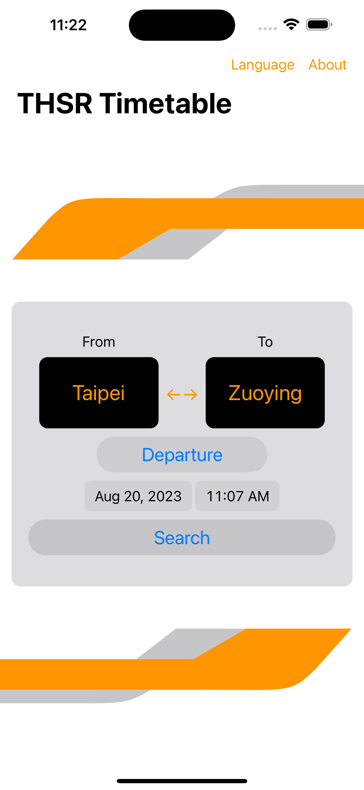
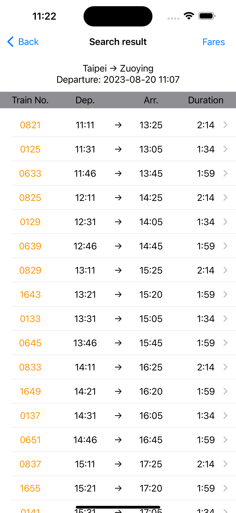
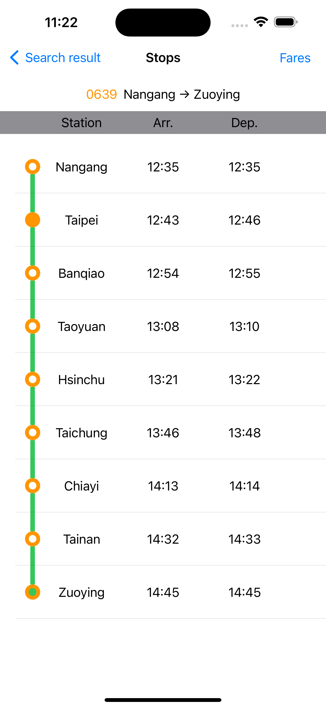
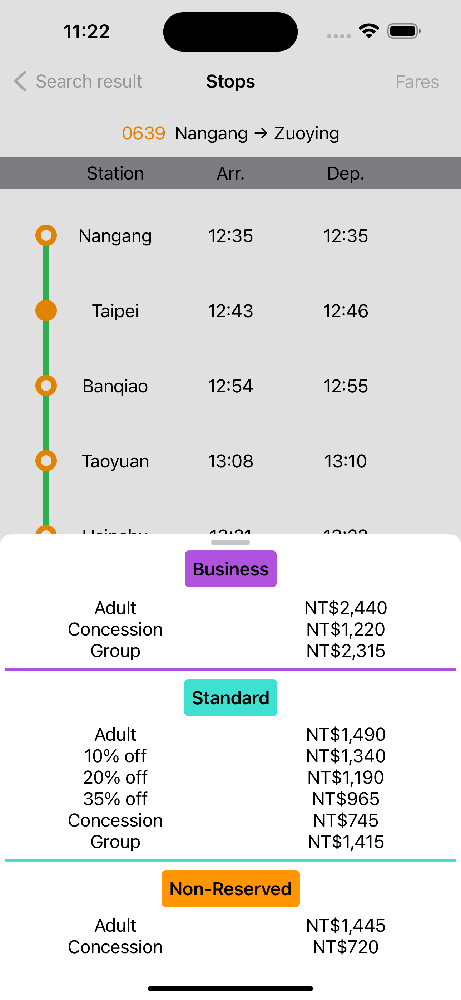
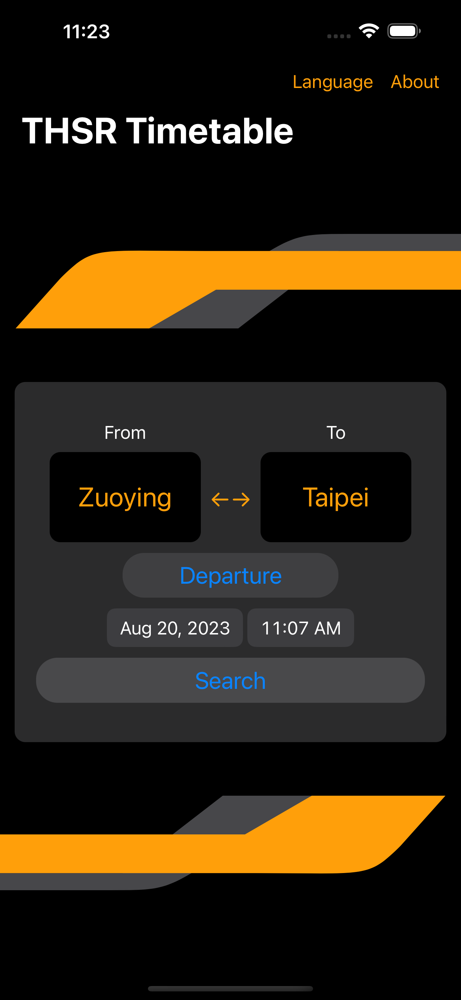
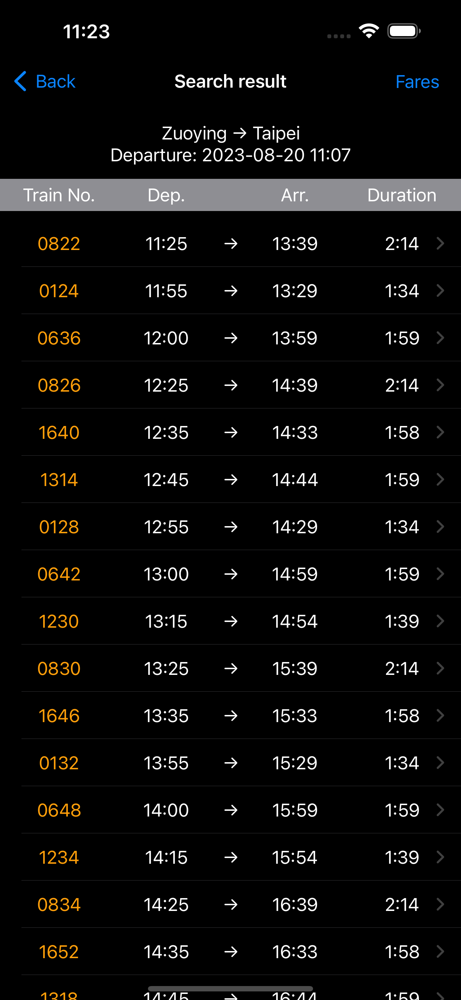
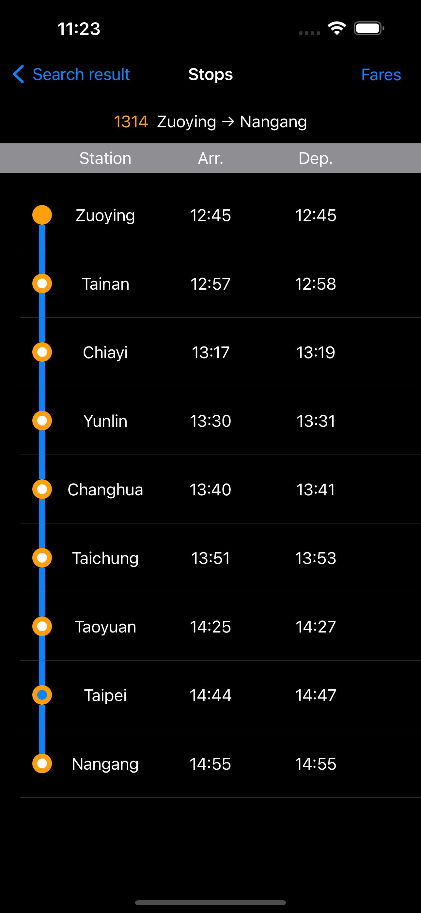
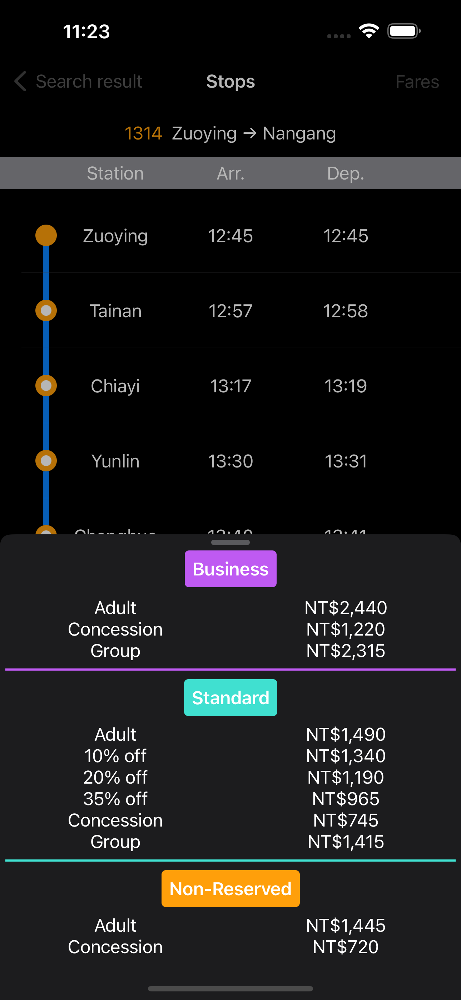

# Taiwan High Speed Rail +

### Simply the most clean looking THSR timetable app

#### Features
- Check the timetable based on departure and destination stations with date and time
- Detail information for each train
- Clear prices for different classes
- Supports light and dark modes
- Built with simplicity in mind

##### Improvements
- The mechanism for token checking
- Refactor code for API call functions in GetTimetable
